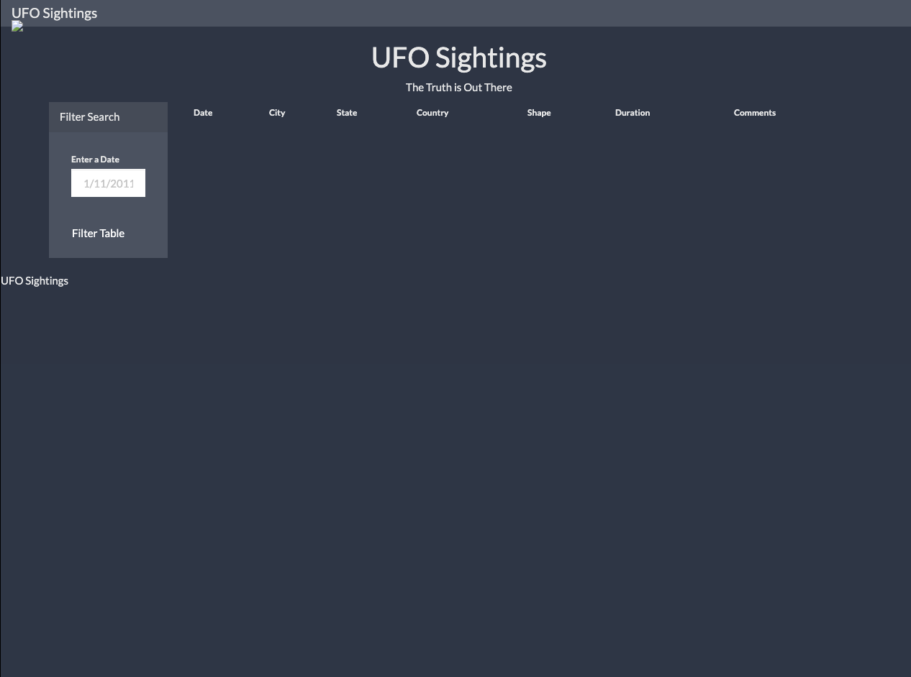
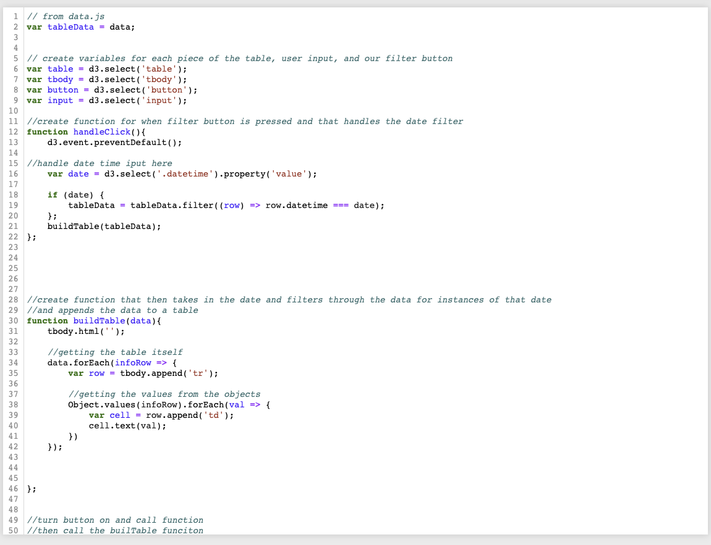

# JavaScript and DOM Manipulation

## Background

WAKE UP SHEEPLE! The extra-terrestrial menace has come to Earth and we here at `ALIENS-R-REAL` have collected all of the eye-witness reports we could to prove it! All we need to do now is put this information online for the world to see and then the matter will finally be put to rest.

There is just one tiny problem though... our collection is too large to search through manually. Even our most dedicated followers are complaining that they are having trouble locating specific reports in this mess.

There's a catch though... we only use pure JavaScript, HTML, and CSS, and D3.js on our web pages. They are the only coding languages which can be trusted.

The planet Earth needs to know what we have found!

### Automatic Table and Date Search

* Here we create a basic HTML webpage with a search bar that allows the user to input a date for a UFO sighting and search for occurances 
 

* The UFO dataset was used in the form of an array of JavaScript objects that was appended to a table on our web page and then adds new rows of data for each UFO sighting.
